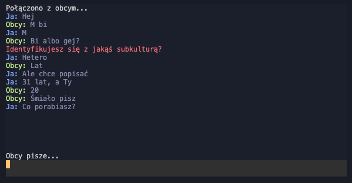

<h1 align="center">6obcy-tui</h1>
<p align="center">Nice TUI/CLI client for the Polish 6obcy.org "Omegle" website. With auto-solving captcha.</p>

<p align="center">
    <a href="https://github.com/skorotkiewicz/6obcy-tui">
        
        
    </a>
</p>

## Installation

To install 6obcy-tui you need NodeJS, if you don't have it you can download from the official site.

Now you can clone the project and install dependencies.

```
$ git clone https://github.com/skorotkiewicz/6obcy-tui
$ yarn
// or
$ npm install
```

## Used

To run the client, all you need to do is run `yarn start` after launching the application, it will automatically open a captcha page in your default browser where you must then enter this code in the client.

```
$ yarn start
// or
$ npm run start
```

Available commands:

- /dis - disconnects and looks for a new user
- /topic - sends a random topic to conversation
- /stop - stops the current conversation and does not look for a new conversation
- /start - searches for a new user and resumes searching for a new conversation when the user disconnects

## Configuration

Client is able to solve captcha by itself thanks to 2captcha.com service, to enable auto captcha solving change `dotenv` file name to `.env` and enter your API key, restarting client will automatically solve every captcha.

```
$ mv dotenv .env
$ nano .env
```

Auto welcome message can be set in .env, this message will be sent every time the conversation starts.

```
$ nano .env

WELCOME = "Hello!"
```

## Todo

- [x] wrap long message inside list
- [x] spinners
- [ ] displaying captcha in the client
